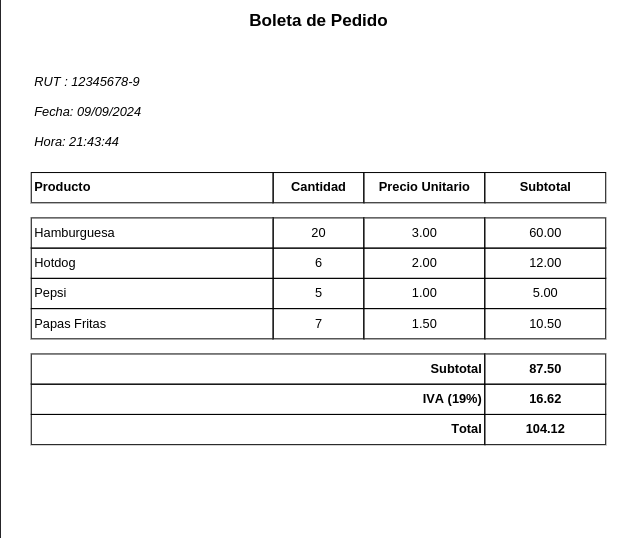

# 🍽️ Restaurante Digital

**Proyecto de Programación II**  
**Evaluación 1 (20% del ramo)**

Desarrollado por: **Rolando Castro** y **Nelson Quiñinao**  

## 📝 Descripción

Este sistema de gestión para restaurantes permite una administración eficiente de ingredientes, stock, pedidos y la generación de boletas. Con una interfaz gráfica fácil de usar, el software optimiza la operación diaria de un restaurante.

🔗[video de demostración](https://www.youtube.com/watch?v=VO07irdyyvs) 


## 🍴 Menús Disponibles

| Menú         | Precio | Ingredientes Necesarios                       |
|--------------|--------|-----------------------------------------------|
| Papas Fritas | $500   | 2 x papas                                     |
| Pepsi        | $1100  | 1 x bebida                                    |
| Hotdog       | $1800  | 1 x salchicha, 1x pan                         |
| Hamburguesa  | $3500  | 1x pan, 1x Carne                              |

## 🥬 Funcionalidades Principales

1. **Ingreso de Ingredientes**
   - **Formulario de Ingreso**: Añadir ingredientes con nombre y cantidad.
   - **Lista de Ingredientes**: Visualización de ingredientes y cantidades en stock .
   - **Gestión de Stock**: Eliminar o actualizar ingredientes.
   - **Generación de Menús**: Mostrar menús disponibles según el stock.

2. **Gestion de Pedidos**
   - **Selección de Menús**: Agregar menús al pedido según el stock disponible.
   - **Eliminación de Menús**: Quitar menús del pedido y reponer ingredientes.
   - **Generación de Boletas**: Crear boletas detalladas en PDF utilizando fpdf.

### Funcionalidades:

1. **Formulario de Ingreso de Ingredientes**:
   - **Nombre del Ingrediente**: Campo de texto para ingresar el nombre del ingrediente (solo letras y espacios).
   - **Cantidad**: Campo numérico para especificar la cantidad de ingredientes a añadir.
   - **Botón "Ingresar Ingrediente"**: Añade el ingrediente al stock, actualizando su cantidad si ya existe.

2. **Lista de Ingredientes**:
   - **Treeview**: Muestra los ingredientes actuales y sus cantidades.
   - **Botón "Eliminar Ingrediente"**: Elimina el ingrediente seleccionado del stock y de la lista.

3. **Botón "Generar Menú"**:
   - Genera los menús disponibles según el stock de ingredientes. Si faltan ingredientes, notifica al usuario.

### 📑 Validaciones:
- **Nombre del Ingrediente**: Solo acepta letras y espacios.
- **Cantidad**: Debe ser un número entero positivo.

## 📦 Pedido

La pestaña de "Pedido" permite gestionar los menús según los ingredientes disponibles, añadiéndolos al pedido, ajustando cantidades y generando boletas.

### Estructura:

1. **Frame Superior: Menús Disponibles**
   - Tarjetas interactivas que representan cada menú con imagen y nombre.
   - Agrega el menú al pedido con un clic, descontando los ingredientes del stock.

2. **Frame Intermedio: Gestión del Pedido**
   - **Botón "Eliminar Menú"**: Elimina un menú del pedido y repone los ingredientes en el stock.
   - **Label de Total**: Muestra el costo total en tiempo real.

3. **Frame Inferior: Detalle del Pedido**
   - **Treeview**: Desglose del pedido con nombre, cantidad y precio unitario.
   - **Botón "Generar Boleta"**: Crea una boleta en PDF del pedido actual, utilizando la librería `fpdf`.

### Imagen de Boleta de referencia



### Interacción:
- **Agregar Menús**: Selecciona menús disponibles según el stock y agrégalos al pedido.
- **Eliminar Menús**: Reintegra ingredientes al stock al eliminar un menú del pedido.
- **Generar Boleta**: Genera un PDF detallado del pedido actual.

## 📑 Funcionalidad Adicional

- **Actualización Automática**: Refleja los cambios en stock y pedido cada vez que se accede a la pestaña de "Pedido".
- **Gestión Dinámica del Stock**: Ajusta automáticamente el stock al añadir o eliminar menús del pedido.

## 📥 Instalación

1. Clona el repositorio:
    ```bash
    git clone https://github.com/tuusuario/restaurante-digital.git
    ```
2. Navega al directorio del proyecto:
    ```bash
    cd restaurante-digital
    ```
3. Instala las dependencias:
    ```bash
    pip install -r requirements.txt
    ```

## 🎮 Uso

Para iniciar la aplicación, ejecuta:

```bash
python app.py